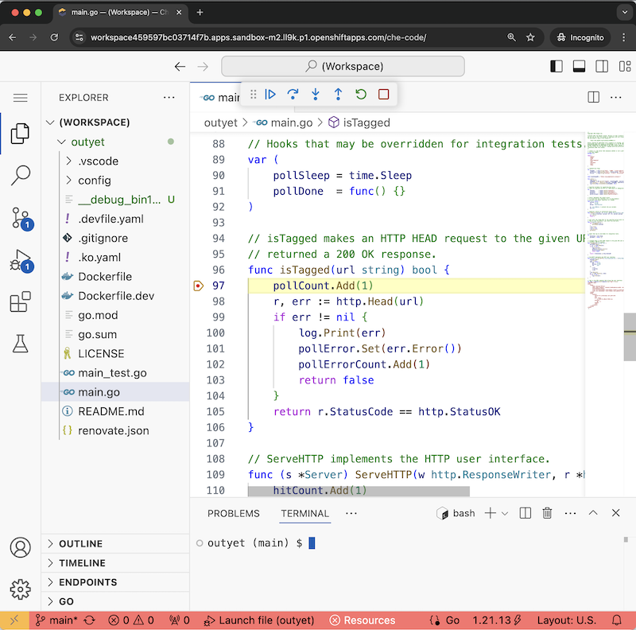
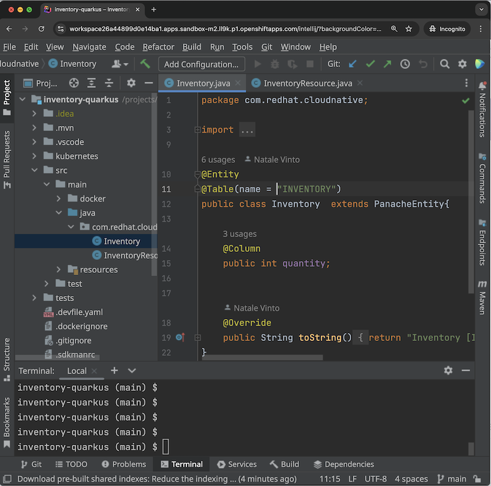
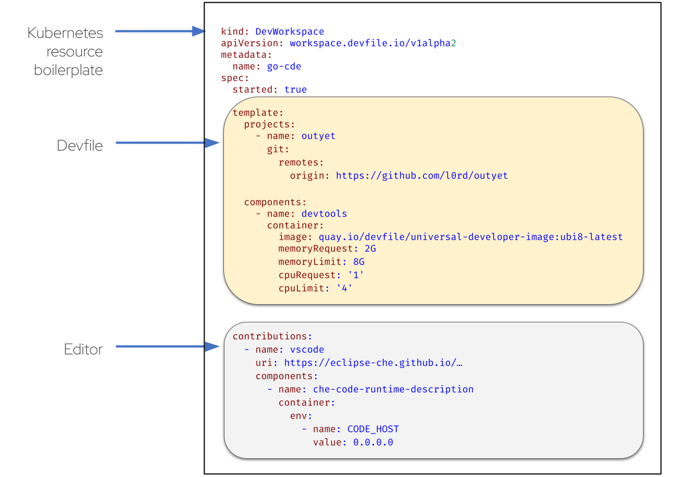
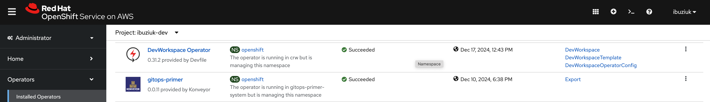
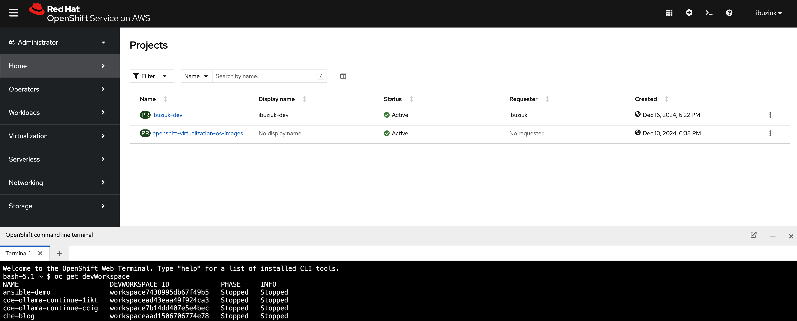

<p align="center"></p>

# DevWorkspace Operator

[](https://codecov.io/gh/devfile/devworkspace-operator)
[](https://www.bestpractices.dev/projects/8258)
[](https://securityscorecards.dev/viewer/?uri=github.com/devfile/devworkspace-operator)

DevWorkspace operator repository that contains the controller for the DevWorkspace Custom Resource. The Kubernetes API of the DevWorkspace is defined in the https://github.com/devfile/api repository.

## What is the DevWorkspace Operator?

A [Kubernetes Operator](https://kubernetes.io/docs/concepts/extend-kubernetes/operator/) to run **fast**, **repeatable**
and **scalable** Cloud Development Environments.

[Install it](#devworkspace-operator-installation) and apply a DevWorkspace to create a Cloud Development Environment:<br/>


Get the Cloud Development Environment URI:<br/>


Open the IDE:<br/>
| Visual Studio Code  | JetBrains IntelliJ |
| ------------- | ------------- |
|  |  |

## Example

Here is a sample `DevWorkspace` to provision a Cloud Development Environment for the project
[github.com/l0rd/outyet](https://github.com/l0rd/outyet) with Visual Studio Code as the editor and
`quay.io/devfile/universal-developer-image:ubi8-latest` as the development tooling container image.<br/>



#### DevWorkspace Template

The Template section of a `DevWorkspace` is actually [a Devfile](https://devfile.io/docs/2.3.0/what-is-a-devfile): the
`spec.template` schema matches the [Devfile schema](https://devfile.io/docs/2.3.0/devfile-schema). :warning: A few 
`Devfile` APIs are
[not supported yet](https://github.com/devfile/devworkspace-operator/blob/main/docs/unsupported-devfile-api.adoc).

#### DevWorkspace Contributions

Contributions are extra `Templates` that are added on top of the main `DevWorkspaceTemplate`. Contributions are used to
inject editors such as Visual Studio Code and JetBrains. Contributions are defined as Devfile or DevWorkspace Templates.
Examples are the
[Visual Studio Code devfile](https://eclipse-che.github.io/che-plugin-registry/main/v3/plugins/che-incubator/che-code/latest/devfile.yaml)
and the
[JetBrains IntelliJ devfile](https://eclipse-che.github.io/che-plugin-registry/main/v3/plugins/che-incubator/che-idea/latest/devfile.yaml).

#### Additional configuration

DevWorkspaces can be further configured through DevWorkspace `attributes`, `labels` and `annotations`. For a list of all
options available, see [additional documentation](docs/additional-configuration.adoc).

## DevWorkspace Operator on Developer Sandbox 

The latest version of the DevWorkspace Operator is pre-installed and available on
[Developer Sandbox for Red Hat OpenShift](https://developers.redhat.com/developer-sandbox), which provides you with
no-cost access to a Kubernetes cluster.



You can login to the cluster using `kubectl` from your local desktop, or use the
[Web Terminal](https://www.redhat.com/en/blog/a-deeper-look-at-the-web-terminal-operator-1) which is also pre-installed
on the Kubernetes cluster:



## DevWorkspace Operator Installation

This section describes how to install the Operator on a cluster using the 
[Operator Lifecycle Manager (OLM)](https://olm.operatorframework.io). The file [CONTRIBUTING.md](CONTRIBUTING.md) has 
instructions to install the Operator, using the `Makefile`, without requiring OLM.

#### Installing the Operator Lifecycle Manager

The Operator Framework website has 
[general instructions to install OLM in your cluster](https://olm.operatorframework.io/docs/getting-started/#installing-olm-in-your-cluster).
On [Minikube](https://minikube.sigs.k8s.io/), OLM is available as
[an addon](https://minikube.sigs.k8s.io/docs/commands/addons/).
OLM is pre-installed on OpenShift.

#### Adding the DevWorkspace Operator catalog source

If the DevWorkspace Operator is not already available amongst the `PackageManifests` (use command
`kubectl get packagemanifest -n olm | grep devworkspace` to check it) you should add a `CatalogSource` in the
cluster:

```bash
kubectl apply -f - <<EOF
apiVersion: operators.coreos.com/v1alpha1
kind: CatalogSource
metadata:
  name: devworkspace-operator-catalog
  namespace: openshift-marketplace # Namespace for catalogsource, not operator itself
spec:
  sourceType: grpc
  image: quay.io/devfile/devworkspace-operator-index:next
  publisher: Red Hat
  displayName: DevWorkspace Operator Catalog
  updateStrategy:
    registryPoll:
      interval: 5m
EOF
```

Two index images are available for installing the DevWorkspace Operator:
* `quay.io/devfile/devworkspace-operator-index:release` - multi-version catalog with all DevWorkspace Operator releases
* `quay.io/devfile/devworkspace-operator-index:next` - single-version catalog that will deploy the latest commit in the `main` branch

Both index images allow automatic updates (to either the latest release or latest commit in main).

#### Create the DevWorkspace Operator Subscription

To install the DevWorkspace Operator, create a OLM Subscription with the following command: 

```bash
kubectl apply -f - <<EOF
apiVersion: operators.coreos.com/v1alpha1
kind: Subscription
metadata:
  name: devworkspace-operator
  namespace: openshift-operators
spec:
  channel: next                            # <--- `next` or `release`
  installPlanApproval: Automatic
  name: devworkspace-operator
  source: devworkspace-operator-catalog    # <--- the catalog created in the previous step
  sourceNamespace: openshift-marketplace
EOF
```

## Contributing

For information on contributing to this project please see [CONTRIBUTING.md](CONTRIBUTING.md).
