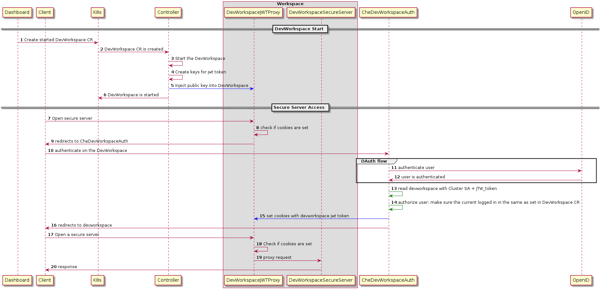
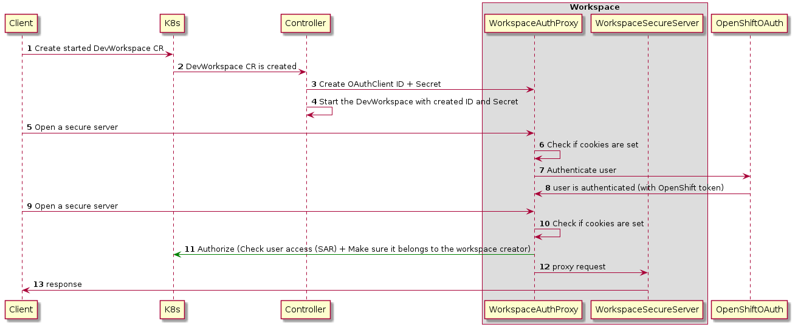

It's the proposal we have as a result of investigation.
You can take a look more alternatives we considered [here](../authentication-schemas). Be ready that they are not simple and detailed enough =)

# Kubernetes

The difficulty we have on kubernetes and workspaces authentication came mainly from requirement Creator Access Only*.

\* Creator Access Only is a feature that currently is not provided by Che at all. It supposes that we guarantee that nobody except workspace creator won't get container access inside container(neigther via K8s API or workspace HTTP endpoints). It was set as a requirement for Web Terminal since we store user's token on file system. In Che case we don't unless user do it manually.

So, we propose not to satisfy that requirement on any Kubernetes cluster. Then we can propose the following abilities:

## Basic HTTPs Routing

It means that we don't provide any authentication on the workspace endpoints. Everything that we need here to support it: implement/provision passthrough proxy container into workspace pod, to make workspace server available since they are supposed to listen to 127.0.0.0 only.

* for simplification we can rely on default certification configured on the Ingress controller side if we have access to CA;

### Basic Authentication HTTPs Routing

If we run all workspace's endpoints on the same host - we can propose to implement Basic Authentication.

It supposes the following scenario:
- a user creates devworkspace on the cluster with htpasswd class routing;
- devworkspace fails with error - missing htpasswd secret;
- user generates and create secret with htpasswd, it's going to be reused for every workspace in that namespace;
- controller reconcile devworkspace and configure devworkspace auth proxy to use that htpasswd;
- user open a devworkspace endpoint but they should type credentials before that can get Theia;

## Che JWTToken Routing

If Che is installed as well on the cluster, user is able to use Che JWTToken based routing for the devworkspaces, it's mainly the same workflow that we have today, the only different devworkspace controller is a guy who manages jwt tokens + Che access K8s cluster directly to do authorization + get JWT token;

* inconvenience: if user creates CR with kubectl (not Che Dashboard or chectl) they need to explicitly set their Keycloak user ID in devworkspace CR.

# OpenShift

## OpenShift OAuth Routing

To provide users an ability to easily have secure workspaces with oc apply, we can propose OpenShift OAuth flow, we currently has in POC. The only thing we need to change:
- improve OpenShift OAuth proxy to being able to proxy different ports;
- improve OpenShift OAuth proxy to being able to authorize user by configured UID;

* inconvenience: I believe a tiny one - at first time user opens a devworkspace CR instance endpoint - they are asked by OpenShift OAuth endpoint that they want to send full:access token into workspace OAuth Client;

## Che JWTToken Routing

OpenShift OAuth routing should be fully compatible with Che in case Che/CRW is configured to use OpenShift OAuth.
Maybe we can make OpenShift OAuth as a requirement. If no, if there is any case where customer is not able to enable OpenShift OAuth, we can provide Che JWTToken Routing on OpenShift as well. But note that keycloak user id should be stored into the DevWorkspace CR, so oc apply -f won't work from the scratch
