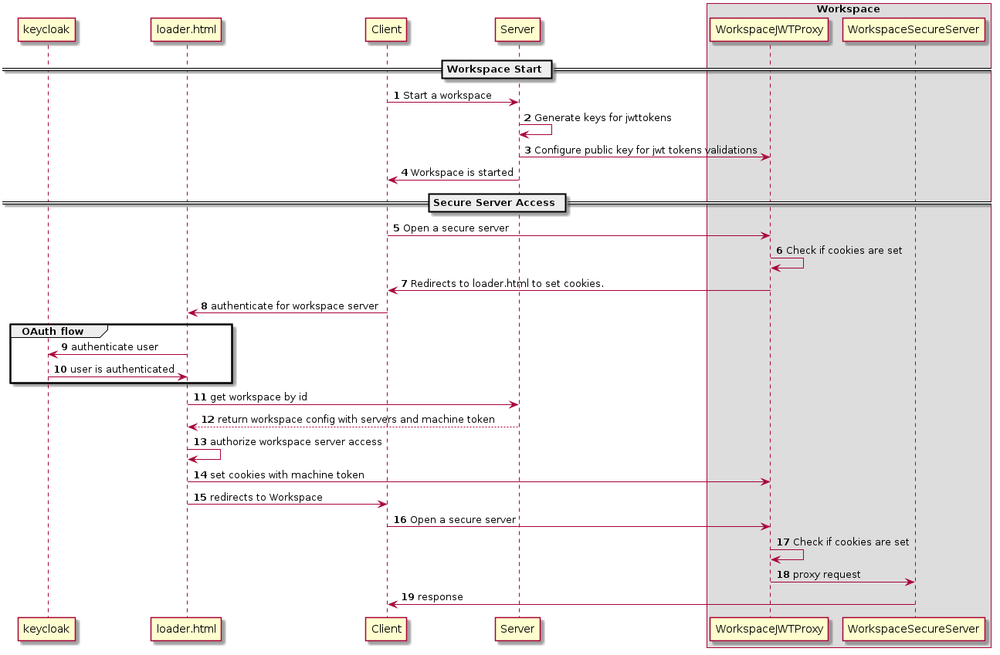
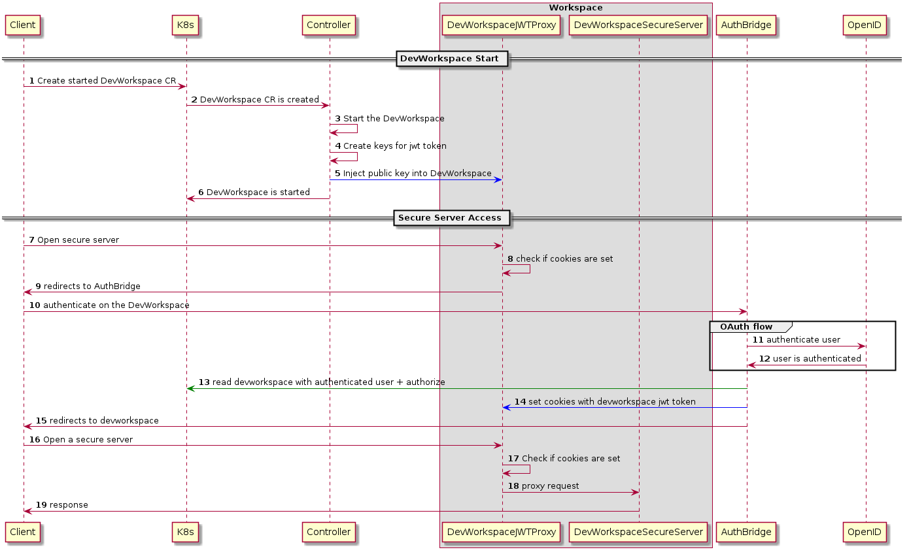
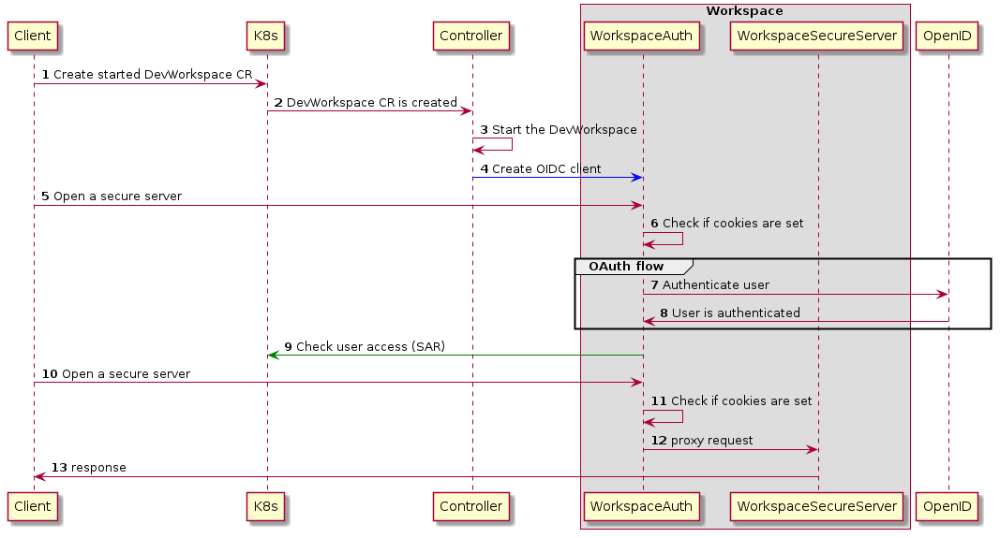

This documents describes the alternatives which could be implemented for DevWorkspace endpoints authentication

# Che Workspaces Servers Authentication

Che Workspace Servers supports SSO(Single Sign-On) which means - user authenticate once on the main host and then user is automatically authenticated on workspaces hosts with loader.html + Che JWT proxy which do the SSO magic.

# DevWorkspaces Servers Authentication with JWTProxy + "AuthBridge" for SSO

It's the mainly the same schema as Che Workspaces have difference here that DevWorkspace Operator should deploy additional component "AuthBridge" which will authorize requests and provide SSO.

Pros:
- Easier to configure (configure AuthBridge to manage OAuth flow)

Cons:
- everybody who is able to read DevWorkspace CR (or DevWorkspaceRouting CR) where jwtproxy is stored - is able to access workspace, which mean we don't provide creator access only;
- Need to manage getting secrets into a devworkspace (e.g. JWT Token)

# DevWorkspaces Servers Authentication with OpenID

Pros:
- no additional component is required;
- No need to solve problem of getting secrets into devworkspaces

Cons:
- probably different clients should be registered on OpenID provider side with workspaces specific endpoints;
  - Difficult to support arbitrary OAuth providers (we can create clients on OpenShift easily, otherwise it's hard.)
- users should authenticate separately for each workspace. User will be asked if they trust that particular domain;

  \* we should be able to run everything on one host, and SSO could be implemented but that's not safe to do without additional authorization since OpenID token will be sent to workspace which may be fake just to steal token.

# TODO:
- Think more about Single Host mode, where AuthBridge and Workspaces live on the same cluster. Can it helps use to provide SSO with creator access only?
