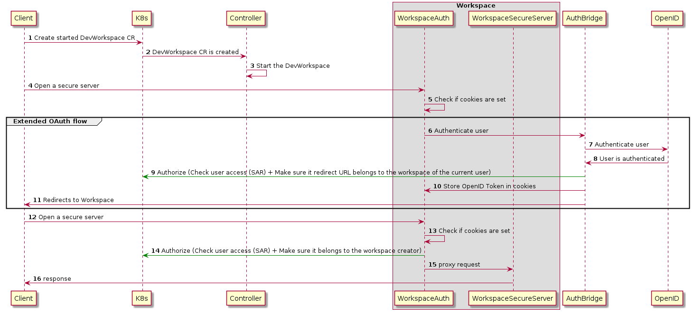
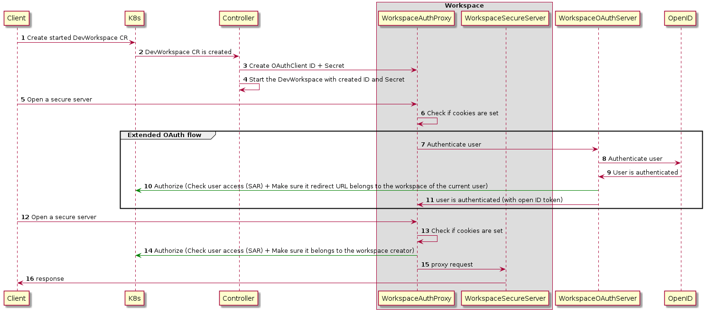

This documents describes the alternatives which could be implemented for DevWorkspace endpoints authentication

# Che Workspaces Servers Authentication

Che Workspace Servers supports SSO(Single Sign-On) which means - user authenticate once on the main host and then user is automatically authenticated on workspaces hosts with loader.html + Che JWT proxy which do the SSO magic.

# DevWorkspaces Servers Authentication with JWTProxy + "AuthBridge" for SSO

It's the mainly the same schema as Che Workspaces have difference here that DevWorkspace Operator should deploy additional component "AuthBridge" which will authorize requests and provide SSO.

Pros:
- Easier to configure (configure AuthBridge to manage OAuth flow)

Cons:
- everybody who is able to read DevWorkspace CR (or DevWorkspaceRouting CR) where jwtproxy is stored - is able to access workspace, which mean we don't provide creator access only;
- Need to manage getting secrets into a devworkspace (e.g. JWT Token)

# DevWorkspaces Servers Authentication with OpenID

Pros:
- no additional component is required;
- No need to solve problem of getting secrets into devworkspaces

Cons:
- different clients MUST be registered on OpenID provider side with workspaces specific endpoints; it's must because during oauth flow at first time user confirm that OAuthClient is trusted but not host, which mean once you logged in your devworkspace with OAuth - your token can be sent to foreign workspace without your confirmation if you open malicious  URL;
  - Difficult to support arbitrary OAuth providers (we can create clients on OpenShift easily, otherwise it's hard.)
- users should authenticate separately for each workspace. User will be asked if they trust that particular domain;

  \* we should be able to run everything on one host, and SSO could be implemented but that's not safe to do without additional authorization since OpenID token will be sent to workspace which may be fake just to steal token.

# DevWorkspace Servers Authentication with Custom OpenID Flow

Pros:
- one openid/oauth client can be safely reused;
- only creator access is provided;
- supports SSO when user logs in once on AuthBridge application;

Cons:
- we need to have two additional components, probably custom:
  - AuthBridge that will be OpenID/OAuth authentication + Authorization;
  - DevWorkspaceAuth Proxy that will do Authorization on K8s server level to provide creator access only;

# DevWorkspace Servers Authentication with Custom OpenID Flow

Pros:
- the same as Custom OpenID flow + Auth protocol is used which is safer option to follow;
- I can imagine that we can remove WorkspaceOAuthServer for OpenShift infra and just reuse the existing OpenShiftOAuth, but with SSO leak - users need explicitly grant workspace to access their token.

Cons:
- some persistence is needed. Probably the most convenient storage for clients - CRs.
  need to check if it still needs Database for tokens storage;

The implementation details are still not very clear... Maybe instead of proxying original OpenID token, we need to generate token new per workspace/oauth client and then on WorkspaceAuthProxy, instead of authorization via k8s cluster - do authorization via our WorkspaceOAuthServer.
